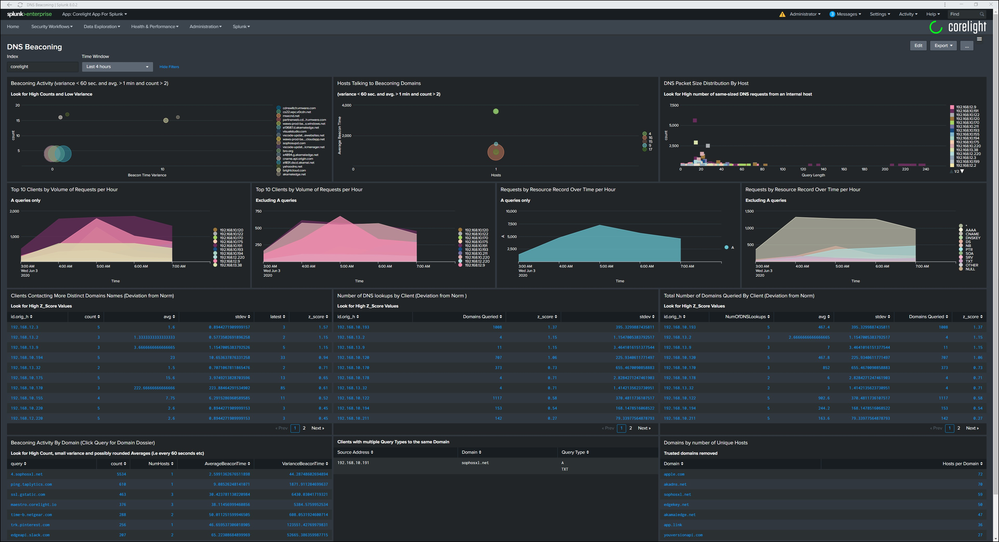

# DNS Hunting-Beaconing v1.0.0

DNS Dashboard for hunting and identifying beaconing

This dashboard no longer uses any third-party modules or a Splunk lookup table to identify "Trusted Domains".  All of that work has been moved to the Corelight/Zeek sensor.

The core of this dashboard is populated with information from parsing DNS Queries.  It also requires a Corelight/Zeek script to parse the DNS query into the required components and to identify "Trusted Domains".  The trusted domains list is optional, however, it is recommended to filter out noise from some of the panels.  Simply update the trusted domains list via the Input Framework and all new log entries with be marked accordingly.

The script can be found here, https://github.com/corelight/icannTLD

